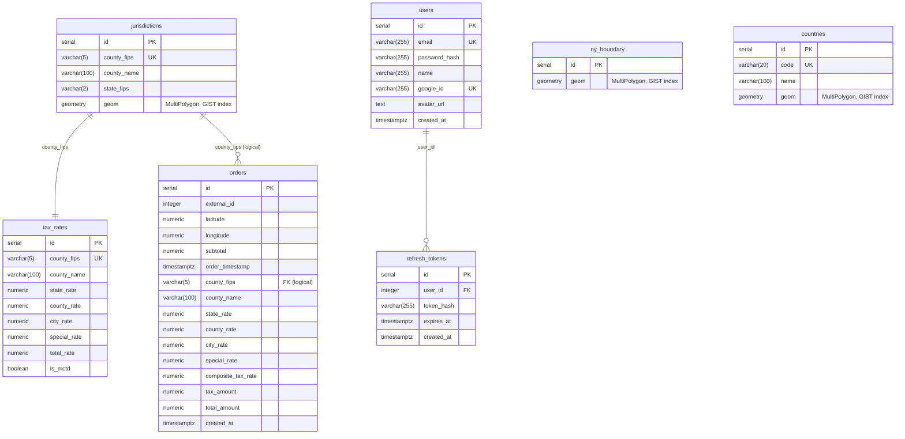

**Deployed Web App:** https://int20h.chivtar.dev

## Business

> Full task specification: [WEB_Dev_TestTask.pdf](./WEB_Dev_TestTask.pdf)

### The Problem

Orders were placed using GPS coordinates — latitude and longitude — as the delivery address. No street, no city, no zip code. Just a point on a map. New York's sales tax system is composite: it layers state, county, city, and special district rates on top of each other, and the exact combination depends on the precise delivery location.

The company had 48 hours to start collecting the correct tax on every order.

### The Solution

Rather than relying on address lookups or third-party geocoding APIs, the system resolves tax jurisdiction directly from coordinates. Each delivery point is matched against geographic boundaries (GeoJSON polygons) for New York's tax jurisdictions. Once the jurisdiction is identified, the applicable composite rate is calculated and broken down into its components: state, county, city, and any special district rates.

The result is attached to every order — the composite rate, the tax amount, and the final total — giving the company a defensible, auditable tax record for every delivery.

## Tech Implementation

**Admin panel** — a protected web app where the team can manage orders. It has three main flows: uploading a multiple CSV files, creating an order manually, and browsing the full orders table with filters and pagination.

**Interactive map** — when creating an order manually, instead of typing raw coordinates, you can open a map of New York with all 62 county boundaries drawn on it. Hover over a county to see its name, click anywhere to drop a pin. The coordinates are filled in automatically, and the app immediately preview the tax breakdown before the order is even saved.

**Tax engine** — the server holds every NY county polygon in PostGIS and runs a spatial point-in-polygon query to find the jurisdiction. Tax rates (state, county, city, special district) are seeded from official NY data and joined to the matched county. Repeated coordinate lookups are served from Redis so the same spot doesn't hit the database twice.

**Auth** — JWT-based authentication with access/refresh token rotation, plus Google OAuth as an alternative login option.

## Frontend

### Stack

- TypeScript — language
- React — framework
- Vite — build tool
- TailwindCSS — styling
- shadcn/ui — UI library
- TanStack Query — data fetching
- React Router — routing
- React Leaflet — map rendering

### Pages

**Login** — email/password form plus a "Continue with Google" button for OAuth.

**Orders table** — paginated table with server-side sorting and two filters: county name (text search) and order date range (date picker). Clicking a row opens a slide-in side panel showing the full tax breakdown for that order.

**Create Order** — flow for creating a single order. Centers on an interactive map of New York; the rest of the page holds the form and the live tax preview.

### Features

**CSV import** — upload a file, the server processes it and returns a summary: how many rows were imported, how many failed, and the first few error messages if anything went wrong.

**Live tax preview** — on the Create Order page, as soon as you pick a location and enter a subtotal, the server calculates and shows the full tax breakdown (state rate, county rate, city rate, special rate, composite rate, tax amount, total) before the order is actually saved.

**Interactive map** — built with React Leaflet, Two GeoJSON layers are loaded from the backend: the NY state outline and all 62 county boundaries. Hovering a county highlights it and shows its name in a tooltip.

**Dark / light mode** — toggle in the header, persisted in `localStorage`.

**Auth flow** — JWT access + refresh token rotation. Google OAuth is handled via a callback route that extracts tokens from query params and logs the user in. Protected routes redirect unauthenticated users to the login page. All API requests attach the bearer token; a 401 response clears the session.

**API Docs shortcut** — a link in the header opens the Swagger UI in a new tab.

## Backend

### Stack

- Go — language
- Fiber — HTTP framework
- GORM — ORM / query builder
- PostgreSQL + PostGIS extension — primary database with spatial query support
- Redis — coordinate lookup cache and refresh token store
- Goose — database migrations
- Swaggo — Swagger docs generation

### Architecture

Clean layered structure: `handler → service → repo`. Handlers parse and validate HTTP requests, services contain all business logic, repos talk to the database or cache.

### API Endpoints

**Auth**

- `POST /api/auth/login` — email + password login, returns access + refresh token pair
- `POST /api/auth/refresh` — exchange a valid refresh token for a new token pair
- `POST /api/auth/logout` — invalidate a refresh token
- `GET  /api/auth/google` — redirect to Google OAuth consent screen
- `GET  /api/auth/google/callback` — handle Google OAuth callback, find or create user, redirect to frontend with tokens in query params

**Orders** _(all require Bearer token)_

- `POST /api/orders/import` — upload a CSV file (up to 50 MB), parse all rows, validate NY bounds, bulk-insert, then apply tax with a single PostGIS `UPDATE … JOIN`
- `POST /api/orders/preview` — calculate tax for given coordinates + subtotal without saving anything
- `POST /api/orders` — create a single order, tax applied immediately
- `GET  /api/orders` — paginated list with filters: county name, date range, min/max total
- `DELETE /api/orders` — wipe all orders

**Geo** _(requires Bearer token)_

- `GET /api/geo/boundary` — NY state outline as GeoJSON (used by the frontend map)
- `GET /api/geo/jurisdictions` — all 62 county polygons as GeoJSON FeatureCollection

**Docs**

- `GET /swagger/*` — Swagger UI

### Database Schema

Seven tables, all created via Goose migrations that run automatically on startup.



### Tax Engine

Every incoming coordinate goes through two checks:

1. **NY state boundary** — `ST_Contains` against the `ny_boundary` table (a union of all county polygons including coastal water zones). Points outside this boundary are rejected with a 422.
2. **County lookup** — `ST_Contains` against `jurisdictions`, joined to `tax_rates`. The matched row gives the full rate breakdown. Points inside the NY boundary but outside all county polygons (open water / coastal zones) get a zero-tax result rather than an error.

Coordinate lookups (single-order and preview flows) are cached in Redis at 4-decimal-place precision (~11 m grid). County boundaries are static, so cache entries carry no expiry.

### Auth

JWT access tokens (short-lived, in-memory on the client) + refresh tokens (longer-lived, stored hashed in the `refresh_tokens` table). Refresh tokens are also tracked in Redis for fast revocation checks without a DB hit. On logout the refresh token is removed from both stores.

Google OAuth creates a user row on first login (keyed by Google ID) or finds the existing one if the email already exists.

## Deploy

### Local Development

```bash
docker-compose up --build
```

| Service  | URL                                      |
| -------- | ---------------------------------------- |
| Frontend | http://localhost:5173                    |
| Backend  | http://localhost:8080                    |
| Swagger  | http://localhost:8080/swagger/index.html |
| Postgres | localhost:5432                           |
| Redis    | localhost:6379                           |

The backend container runs in `dev` mode with a live-reload volume mount. The frontend runs Vite dev server. Migrations and seeding run automatically on backend startup — no manual setup needed.

### Production (k8s on VM)

The production setup uses Kubernetes manifests managed by Kustomize, deployed to a cluster running Traefik as the ingress controller.

**CI/CD pipeline** (`.github/workflows/docker-publish.yml`):

1. On every push to `main`, GitHub Actions builds Docker images for both `backend` and `frontend` using the `prod` Dockerfile target.
2. Images are pushed to GitHub Container Registry (`ghcr.io`) tagged with `latest` and a short commit SHA (`sha-xxxxxxx`).
3. A second job updates the image tags in `k8s/kustomization.yaml` and commits the change back to the repo with `[skip ci]`.

**Kubernetes manifests** (`k8s/`):

| File                 | What it creates                                                                        |
| -------------------- | -------------------------------------------------------------------------------------- |
| `backend.yaml`       | Deployment + Service, secrets from `app-secrets`                                       |
| `frontend.yaml`      | Deployment + Service (nginx, port 80)                                                  |
| `postgres.yaml`      | Deployment + Service + 5 Gi PersistentVolumeClaim                                      |
| `redis.yaml`         | Deployment + Service                                                                   |
| `ingress.yaml`       | Traefik Ingress — routes `/api` and `/swagger` to backend, everything else to frontend |
| `kustomization.yaml` | Pins image tags; apply with `kubectl apply -k k8s/`                                    |
